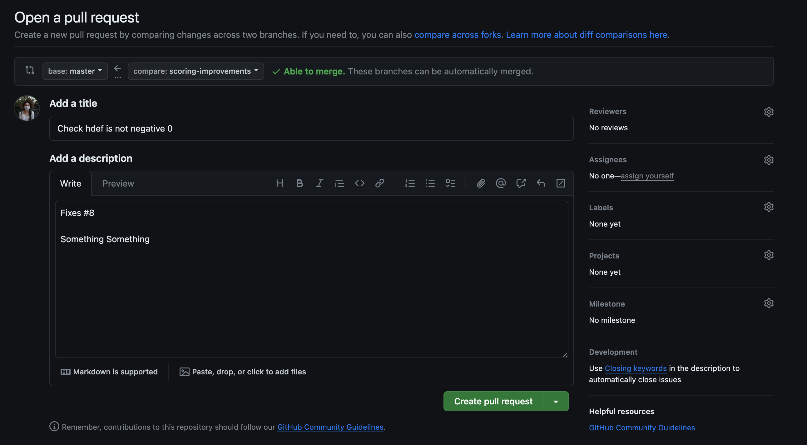

# Start Here
This repository is to help our team learn how to use git and github. Here is a link to read more about [git and github](https://docs.github.com/en/get-started/quickstart/about-github-and-git)

## Steps for Git
1. Install git and/or github desktop on your device.
    * [git download](https://git-scm.com/)
    * [github desktop](https://desktop.github.com/)
2. Clone the repository. This makes a copy of the files that you can edit on your machine.
    * [How to clone a repository](https://docs.github.com/en/repositories/creating-and-managing-repositories/cloning-a-repository) (there are many different ways to do this)
3. Check if an issue is assigned to you.
4. Create a branch titled something meaningful, like"{Issue Number}-{descriptor of issue}"
    * **Example:** Say I was assigned issue 123 that asked to implement a scroll bar. I could name my branch "123-scroll-bar" to show what I was working on.
    * Sometimes, you will need to work on something that doesn't have an issue opened for it. I recommend opening a new issue that describes what you are planning to work on and name the branch as described above. Otherwise, still try to give a meaningful name to your branch (ex. "automated-tests").
    * Names like "ashley-branch" or "new-stuff" are not helpful to someone reviewing the repository.
5. On your new branch, implement your changes.
6. Commit often. Commit early.
    * [About commits](https://docs.github.com/en/pull-requests/committing-changes-to-your-project/creating-and-editing-commits/about-commits)
    * [Overview of command line commits](https://github.com/git-guides/git-commit)
    * On github, a commit with two messages will show the first message as a preview and the second message when the commit is clicked. Please make the first message a brief description of the commit and the second message a more detailed description of what was changed
  
    * **Example: Command Line Commit**
      
          git commit -m "Changed log file output" -m "Now when unit test fails, the error message {error_msg} is added to the log file. Changes made in files Logger.ts and app.component.ts
7. Push your changes to remote repository.
    * [git push](https://github.com/git-guides/git-push)
8. Create a pull request to merge changes to master branch.
    * [About pull requests](https://docs.github.com/en/pull-requests/collaborating-with-pull-requests/proposing-changes-to-your-work-with-pull-requests/about-pull-requests)
    * [Creating a pull request](https://docs.github.com/en/pull-requests/collaborating-with-pull-requests/proposing-changes-to-your-work-with-pull-requests/creating-a-pull-request)
    * Link pull request with the issue it resolves with "fixes #{issue number}" somewhere in the pull request
    *  **Example:**
  
9. Assign someone to review your pull request.
10. Review the pull requests that are assigned to you.
    * Accept merge if changes resolve the issue.
    * Comment on the pull request if more changes are necessary.
11. Resolve merge conflicts.
    * [Resolving conflicts on Github](https://docs.github.com/en/pull-requests/collaborating-with-pull-requests/addressing-merge-conflicts/resolving-a-merge-conflict-on-github)
    * [Resolving conflicts using command line](https://docs.github.com/en/pull-requests/collaborating-with-pull-requests/addressing-merge-conflicts/resolving-a-merge-conflict-using-the-command-line)
    * You can also resolve them using your IDE/editor
12. Pull changed from the remote to your machine
    * [git pull](https://github.com/git-guides/git-pull)
    * Updates the files on your device if someone else has pushed changed to the remote repository.
13. Profit!!!

## Steps for Hello World
We are using the [Hello World Tutorial](https://angular.dev/tutorials/first-app/hello-world) from [Angular.dev](https://angular.dev/)
### Tools Needed
1. IDE, like VS code
2. [npm installed](https://docs.npmjs.com/downloading-and-installing-node-js-and-npm)
3. [Node.js installed](https://nodejs.org/en/download/)
    * check that your version of node is meets the [requirements for angular](https://unpkg.com/browse/@angular/core@17.1.1/package.json)
4. Install [Angular CLI](https://angular.dev/tools/cli)
    * Run:
  
    ```
    npm install -g @angular/cli.
    ```
    * You can use any version of node and angular for this tutorial as long as it works. This isn't production code.
  

### Steps to Run app
1. Navigate to this repo's directory in your terminal
    * It should already be there if you open the terminal in VS code from the folder
2. Run
    ```
    npm install
    ```
3. Run
   ```
   ng serve
   ```
4. Go to `http://localhost:4200/` in your browser to see the webpage.

Note: If you get warnings during these steps, and `npm audit fix` does not fix them, don't worry. It will probably still run.
